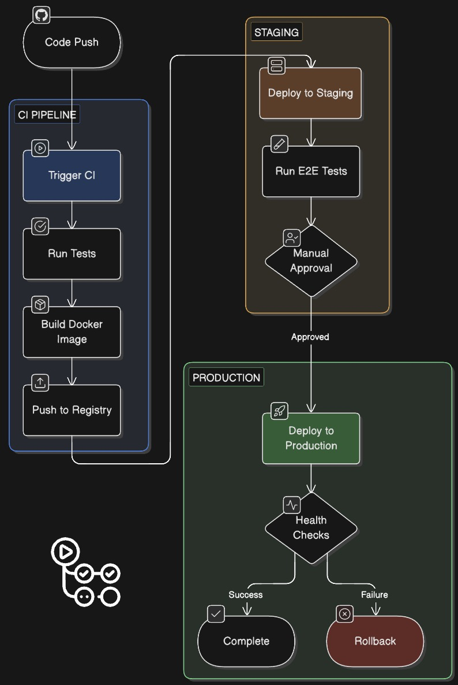

# Core System Designs

## 1.1 Feed Generation System

**Problem**: Generate personalized feed for 100M DAU efficiently

**Solution**: Hybrid Push-Pull Model

### For Users with Few Followers (< 10K)
**Push Model (Fan-out on Write)**
1. When user posts, push post_id to all followers' feeds
2. Store in Cassandra user_feed table
3. Followers read from pre-computed feed

### For Users with Many Followers (> 10K - Celebrities)
**Pull Model (Fan-out on Read)**
1. Don't fan-out on write
2. When follower requests feed, fetch posts from these users
3. Merge with regular feed

### Feed Ranking Algorithm


### Implementation Flow


---

## 1.2 Media Upload & Processing Pipeline

### Upload Flow
```
1. Client requests signed URL from Media Service
2. Media Service generates MinIO presigned URL
3. Client uploads directly to MinIO (bypassing backend)
4. MinIO triggers webhook/processing service
5. Processing service:
   - Validates image
   - Generates thumbnails (multiple sizes)
   - Compresses original
   - Extracts metadata (dimensions, EXIF)
   - Updates database with URLs
   - Publishes event to message queue
6. Post Service receives event, creates post entry
7. Feed Service fans out to followers
```

### Feed Service Flow


### Image Processing Requirements
- Original: Store as-is (compressed)
- 1080x1080: Full size display
- 640x640: Feed display
- 320x320: Thumbnail
- 150x150: Profile picture size

### Video Processing
- Transcode to multiple bitrates (adaptive streaming)
- Generate thumbnail from first frame
- Extract duration and metadata
- Compress for optimal delivery

---

## 1.3 Social Graph Management

### Follow/Unfollow System

**Write Path:**
```
1. User A follows User B
2. Write to follows table:
   INSERT INTO follows (follower_id, followee_id, created_at)
3. Update counters (eventual consistency):
   - User A following_count++
   - User B follower_count++
4. Add User B's posts to User A's feed (async)
5. Publish event for notifications
```

**Read Path (Get Followers):**
```
1. Check Redis cache: followers:user_id
2. If miss, query database:
   SELECT follower_id FROM follows WHERE followee_id = ?
3. Paginate results (cursor-based)
4. Cache in Redis (TTL: 1 hour)
```

### Handling Celebrity Accounts
- Don't fan-out posts to all followers on write
- Use pull model when followers request feed
- Cache celebrity's recent posts heavily
- Use dedicated read replicas for popular accounts

---

## 1.4 Notification System

**Architecture:**
```
Event Source → Message Queue → Notification Service → Push/WebSocket
```

### Notification Types
1. **Social Notifications**
   - New follower
   - Post liked
   - Post commented
   - User tagged

2. **Content Notifications**
   - Posts from followed users
   - Trending content

### Implementation
```
1. Action occurs (e.g., like)
2. Publish event to RabbitMQ
3. Notification Service consumes event
4. Check user notification preferences
5. Create notification entry in DB
6. Send via appropriate channel:
   - Push notification
   - WebSocket for active users
   - Email digest (batched)
```

### Notification Batching
- Group similar notifications: "User A and 10 others liked your post"
- Batch email notifications (hourly/daily digest)
- Rate limit per user to prevent spam

---

## 1.5 Search System

**Multi-tiered Search:**

1. **User Search**
   - Index in OpenSearch
   - Search by username, full_name
   - Boost verified accounts
   - Autocomplete support

2. **Hashtag Search**
   - Real-time trending calculation
   - Index in OpenSearch
   - Count posts per hashtag
   - Time-decay for trending

3. **Content Discovery**
   - ML-based recommendations
   - Collaborative filtering
   - Content-based filtering

**Search Query Flow:**


---

# 2. Scalability Strategies

## 2.1 Database Sharding

**User Data Sharding:**
- Shard key: user_id
- Consistent hashing
- 1024 logical shards -> mapped to physical servers

**Post Data Sharding:**
- Shard key: user_id 
- Alternative: (user_id, created_at) for time-based queries

**Social Graph Sharding:**
- Shard key: follower_id for follows table
- Replicate popular users across shards

---

## 2.2 Caching Strategy

**Multi-level Cache:**
1. **Application Cache** (local): 
   - In-memory cache per service instance
   - TTL: 60 seconds
   
2. **Distributed Cache** (Redis):
   - Shared across all instances
   - TTL: 5-60 minutes
   
3. **CDN Cache**:
   - Edge caching for media
   - TTL: 24 hours

**Cache Patterns:**
- Cache-aside for reads
- Write-through for critical data
- Write-behind for analytics

---

## 2.3 Load Balancing

**Application Load Balancers:**
- Round-robin with health checks
- Sticky sessions for WebSocket connections
- SSL termination at load balancer

**Database Load Balancing:**
- Read replicas for heavy read workload
- Write to primary, read from replicas
- Replica lag monitoring

---

## 2.4 Horizontal Scaling

**Stateless Services:**
- All services are stateless
- Easy to scale up/down
- Auto-scaling based on CPU/memory

**Stateful Components:**
- Databases: Read replicas + sharding
- Cache: Redis cluster
- Message Queue: RabbitMQ partitions

---

# 3. Technology Stack

1. **MinIO**
   - S3-compatible API (easy migration if needed)
   - Self-hosted = full control and cost savings
   - High performance (can saturate network bandwidth)
   - Deploy on your own hardware or any cloud provider
   - No vendor lock-in

2. **ScyllaDB**
   - Drop-in Cassandra replacement (same CQL protocol)
   - Written in C++ (vs Java) = 10x faster performance
   - Lower latency (sub-millisecond p99)
   - Better hardware utilization
   - Smaller cluster = lower costs

3. **OpenSearch**
   - Open-source fork of Elasticsearch 7.10
   - No licensing restrictions
   - Community-driven development
   - 100% compatible with Elasticsearch APIs

4. **CloudFlare**
   - CloudFlare: Free tier available, global network
   - Both cloud-agnostic
   - Excellent performance globally

---

## 3.1 Backend

**API Layer:**
- **Language**: Node.js 
- **Framework**: 
  - Node.js: Express / Fastify
  
- **API Protocol**: REST + gRPC for inter-service

**Service Communication:**
- **Synchronous**: gRPC
- **Asynchronous**: RabbitMQ
- **Service Discovery**: Kubernetes DNS

---

## 3.2 Databases

- **Primary DB**: PostgreSQL 14+
- **Cache**: Redis 7+ (Cluster mode)
- **Graph DB**: PostgreSQL with extensions
- **Time-series/Feed**: ScyllaDB (Cassandra-compatible, 10x faster)
- **Search**: OpenSearch
- **Object Storage**: MinIO (Self-hosted, S3-compatible)

---

## 3.3 Frontend

**Web:**
- **Framework**: React 18+ 
- **State Management**: Redux Toolkit
- **Styling**: Tailwind CSS
- **Build Tool**: Vite / Webpack

**Mobile:**
- **iOS**: Swift 
- **Android**: Kotlin 
- **Alternative**: React Native 

---

## 3.4 Infrastructure

**Container Orchestration:**
- **Kubernetes** (EKS / GKE / AKS)
- **Docker** for containerization

**CI/CD:**
- **GitHub Actions** 
- **ArgoCD** for GitOps

**Monitoring & Logging:**
- **Metrics**: Prometheus + Grafana
- **Logging**: Loki
- **Tracing**: Jaeger
- **APM**: SigNoz (open-source)

**CDN & Edge:**
- CloudFlare
- Edge computing for image optimization

---

# 4. API Design

## 4.1 RESTful Endpoints

### User Service
```
POST   /api/v1/users/register
POST   /api/v1/users/login
GET    /api/v1/users/{user_id}
PUT    /api/v1/users/{user_id}
GET    /api/v1/users/{user_id}/followers
GET    /api/v1/users/{user_id}/following
POST   /api/v1/users/{user_id}/follow
DELETE /api/v1/users/{user_id}/follow
```

### Post Service
```
POST   /api/v1/posts
GET    /api/v1/posts/{post_id}
PUT    /api/v1/posts/{post_id}
DELETE /api/v1/posts/{post_id}
GET    /api/v1/posts/{post_id}/likes
POST   /api/v1/posts/{post_id}/like
DELETE /api/v1/posts/{post_id}/like
GET    /api/v1/posts/{post_id}/comments
POST   /api/v1/posts/{post_id}/comments
```

### Feed Service
```
GET    /api/v1/feed/home?cursor={cursor}&limit=20
GET    /api/v1/feed/explore?cursor={cursor}&limit=20
GET    /api/v1/feed/user/{user_id}?cursor={cursor}&limit=20
```

### Search Service
```
GET    /api/v1/search/users?q={query}&limit=10
GET    /api/v1/search/hashtags?q={query}&limit=10
GET    /api/v1/search/posts?q={query}&limit=20
```

### Media Service
```
POST   /api/v1/media/upload-url
GET    /api/v1/media/{media_id}
```

---

## 4.2 WebSocket Endpoints

```
WS     /ws/notifications
WS     /ws/messages (Phase 2)
```

---

## 4.3 Response Format

**Success Response:**
```json
{
  "status": "success",
  "data": {
    "user_id": "123e4567.....",
    "username": "johndoe",
    "full_name": "John Doe"
  },
  "meta": {
    "timestamp": "2025-02-06T10:30:00Z"
  }
}
```

**Error Response:**
```json
{
  "status": "error",
  "error": {
    "code": "USER_NOT_FOUND",
    "message": "The requested user does not exist",
    "details": {}
  },
  "meta": {
    "timestamp": "2025-02-06T10:30:00Z",
    "request_id": "abc-123-def"
  }
}
```

---

## 4.4 Pagination

**Cursor-based pagination** (preferred for feeds):
```
GET /api/v1/feed/home?cursor=e...

Response:
{
  "data": [...],
  "pagination": {
    "next_cursor": "abcdef...",
    "has_more": true
  }
}
```

---

# 5. Security Considerations

## 5.1 Authentication & Authorization

**JWT-based Authentication:**
- Access token (15 min expiry)
- Refresh token (7 days expiry)
- Stored in httpOnly cookies

**Authorization Levels:**
- Public content (anyone)
- Authenticated users
- Content owner only
- Admin/moderator access

---

## 5.2 Data Protection

- **Encryption at Rest**: Database and S3 encryption
- **Encryption in Transit**: TLS 1.3 for all communications
- **Password Hashing**: bcrypt with salt (cost factor 12)
- **PII Protection**: GDPR compliance, data minimization

---

## 5.3 Rate Limiting

**Per User:**
- 100 requests per minute (general API)
- 10 posts per hour
- 100 follows per day
- 1000 likes per day

**Per IP:**
- 1000 requests per minute
- Protection against DDoS

---

## 5.4 Content Moderation

- **Automated**: ML-based content filtering
- **Manual**: Reported content review queue
- **NSFW Detection**: Image classification
- **Spam Prevention**: Rate limiting, CAPTCHA

---

# 6. Monitoring & Observability

## 6.1 Metrics to Track

**System Metrics:**
- Request rate (RPS)
- Error rate (4xx, 5xx)
- Response time (p50, p95, p99)
- Database query time
- Cache hit rate

**Business Metrics:**
- Daily Active Users (DAU)
- Posts created per day
- User engagement rate
- Feed load time
- Upload success rate

---

## 6.2 Alerting

**Critical Alerts:**
- Service down (> 1 min)
- Error rate > 5%
- Database replication lag > 10 seconds
- Disk usage > 85%

**Warning Alerts:**
- Response time > 1 second (p95)
- Cache hit rate < 80%
- Queue depth > 1000 messages

---

## 6.3 Logging Strategy

**Log Levels:**
- ERROR: Application errors
- WARN: Degraded performance
- INFO: Important business events
- DEBUG: Detailed troubleshooting

**Structured Logging:**
```json
{
  "timestamp": "2025-02-06T10:30:00Z",
  "level": "INFO",
  "service": "post-service",
  "trace_id": "abc123",
  "user_id": "user_123",
  "event": "post_created",
  "post_id": "post_456",
  "duration_ms": 45
}
```

---

# 7. Deployment Strategy

## 7.1 Environment Setup

**Environments:**
1. **Development**: Local development
2. **Staging**: Production mirror for testing
3. **Production**: Live environment

---

## 7.2 CI/CD Pipeline


---

## 7.3 Deployment Patterns

**Blue-Green Deployment:**
- Maintain two identical environments
- Deploy to inactive environment
- Switch traffic after validation
- Easy rollback

**Canary Deployment:**
- Deploy to small percentage of traffic (5%)
- Monitor metrics
- Gradually increase if healthy
- Full rollback if issues detected