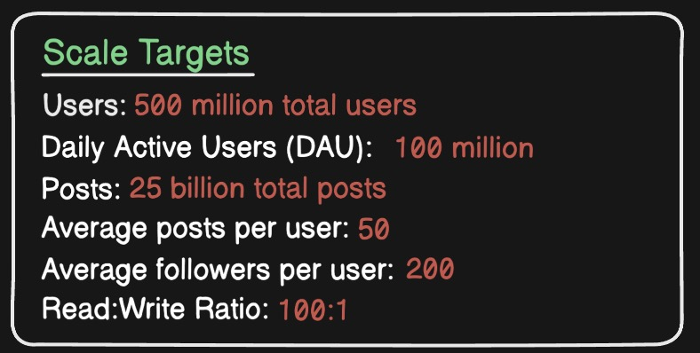
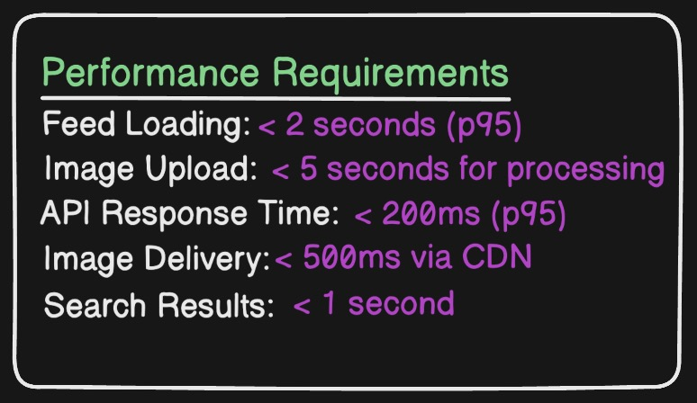
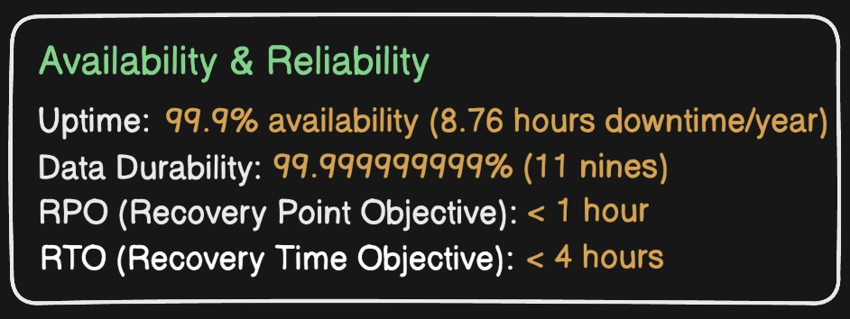
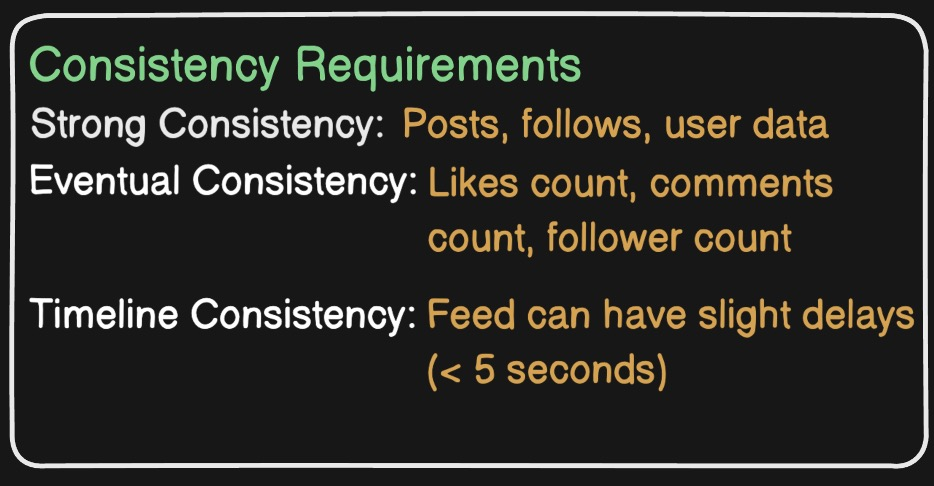
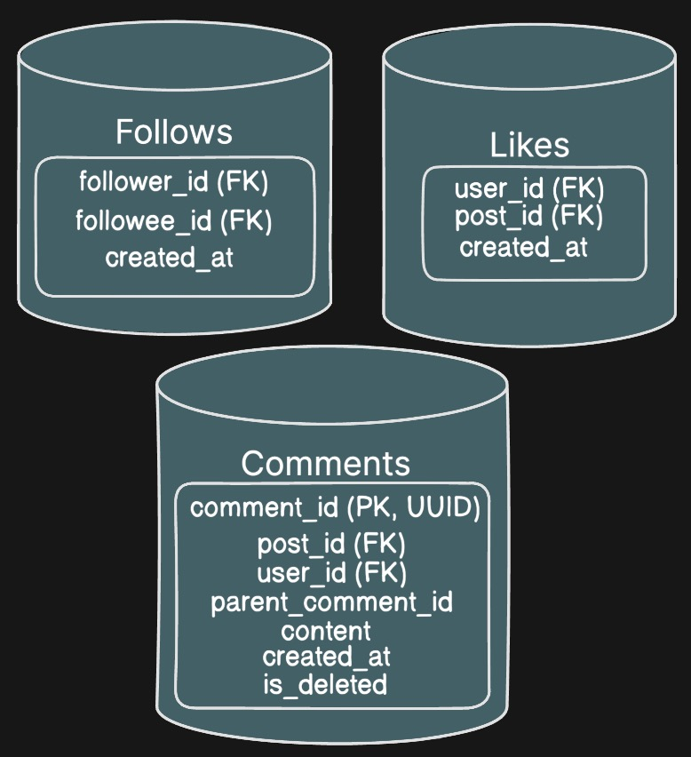

# Vistagram Framework Documentation

## Project Overview

**Vistagram** is a scalable social media platform for sharing visual moments and connecting through photography. This document outlines the complete system design framework, architectural decisions, and implementation strategy.

---

## 1. System Requirements

### 1.1 Functional Requirements

#### Core Features
- **User Management**
  - User registration and authentication
  - Profile creation and editing (bio, profile picture, username)
  - Account privacy settings (public/private)

- **Content Management**
  - Upload photos and videos with captions
  - Add hashtags and location tags
  - Edit/delete own posts
  - Support multiple image formats (JPEG, PNG, HEIC)
  - Video processing and compression

- **Social Interactions**
  - Follow/unfollow users
  - Like posts
  - Comment on posts
  - Reply to comments
  - Tag users in posts

- **Feed System**
  - Personalized home feed (posts from followed users)
  - Chronological and algorithm-based feed options
  - Explore feed (discover new content)
  - User profile feed (view specific user's posts)

- **Discovery**
  - Search users by username
  - Search hashtags
  - Trending content
  - Location-based discovery

- **Notifications**
  - Real-time notifications for likes, comments, follows
  - Push notifications support
  - In-app notification center

### 1.2 Non-Functional Requirements

#### Scale Targets

#### Performance Requirements

#### Availability & Reliability

#### Consistency Requirements

---

## 2. High-Level Architecture

### 2.2 Core Components

#### Client Layer
- **Web Application**: React/Next.js SPA
- **Mobile Apps**: iOS (Swift) and Android (Kotlin)
- **Progressive Web App** (PWA) support

#### Edge Layer
- **CDN**: CloudFlare/CloudFront for static assets and media
- **Load Balancers**: Distribute traffic across API servers
- **DDoS Protection**: Rate limiting and security

#### API Gateway
- **Authentication & Authorization**: JWT tokens
- **Request Routing**: Direct requests to appropriate services
- **Rate Limiting**: Prevent abuse
- **API Versioning**: Support multiple API versions
- **Protocol Translation**: REST to gRPC

#### Service Layer (Microservices)

---

## 3. Data Architecture

### 3.1 Database Strategy

#### Primary Databases

**1. User Data - PostgreSQL (Relational)**

**2. Post Data - PostgreSQL (Relational)**

**3. Social Graph - PostgreSQL (Relational)**

### 3.2 Caching Strategy

**Redis Cache Layers:**

1. **Hot Data Cache** (TTL: 1 hour)
   - User profiles of active users
   - Popular posts
   - Trending hashtags

2. **Feed Cache** (TTL: 5 minutes)
   - Pre-computed home feeds
   - User profile feeds
   - Explore feed

3. **Counter Cache** (No TTL, updated on write)
   - Post like counts
   - Comment counts
   - Follower counts

4. **Session Cache** (TTL: 24 hours)
   - User authentication tokens
   - Active sessions

**Cache Invalidation:**
- Write-through for critical data
- Write-behind for analytics
- Event-driven invalidation via message queue